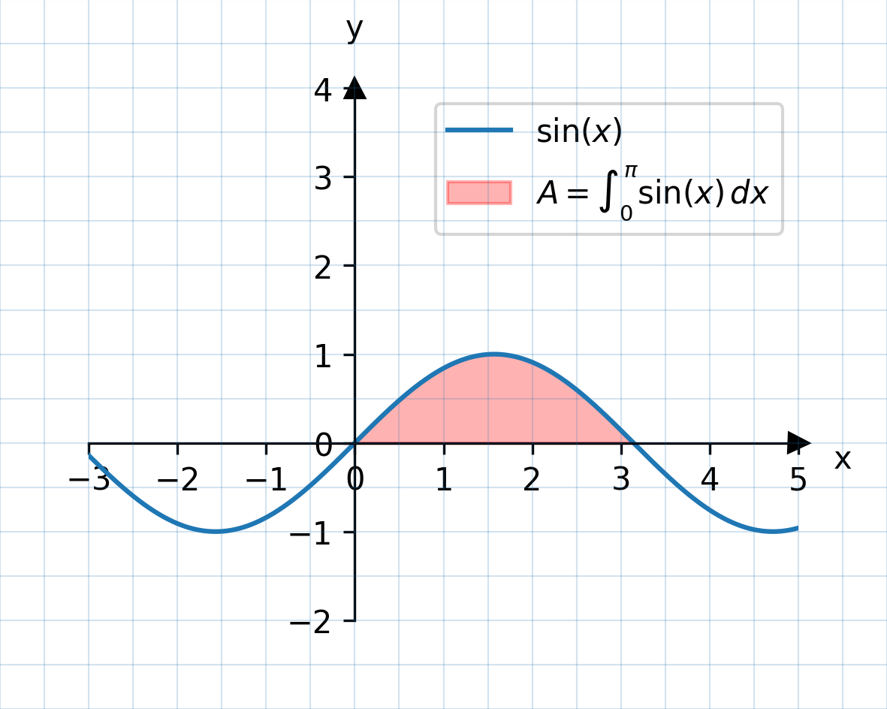
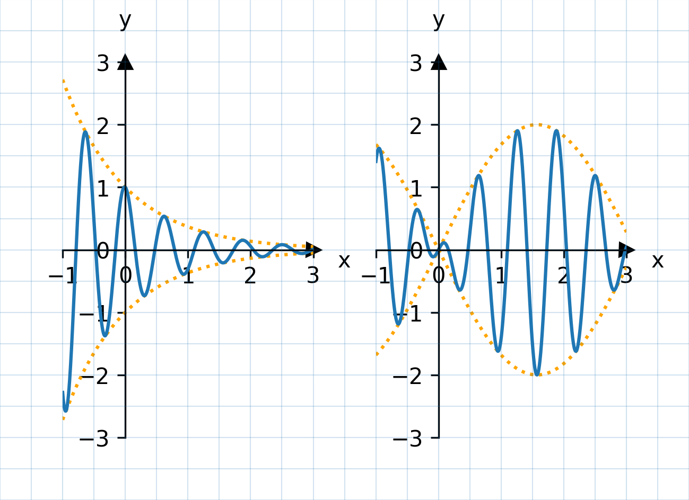

# schulplots - ein Tool zum Erzeugen von 2D-Plots im schul-üblichen Stil

** This project is mainly targeted to a German speaking community. Maybe I will add an english translation later. Thanks for your patience :-) **

`schulplots` ermöglicht es, 2D-Graphen von Funktionen zu erzeugen, die so aussehen, wie Schüler es kennen.

Die Abbildung wird hierbei mit einer Beschreibungs-Datei beschrieben, die von `schulplots`in eine Abbildung umgewandelt wird.

## Beispiel


Dieses Bild wird durch die folgende Beschreibung im YAML-Format erzeugt:

```yaml
figure:
  height: 8cm
  width: 10cm
axes_descriptors:
- axes:
    height: 6cm
    width: 8cm
    x_min: -3
    y_min: -2
  bottom: 1cm
  left: 1cm
  graphs:
  - function: sin(x)
    label: $\sin(x)$
  areas:
  - function:
    - sin(x)
    - 0*x
    label: $A = \int_0^\pi \sin(x)\,dx$
    condition: y1 >= y2
    plot_args:
      alpha: 0.3
      color: red

```
Die Beschreibungsdatei hat Haupt-Sektionen:
1. `figure`: Diese Sektion enthält Informationen über die gesamte Abbildung. Im Beispiel werden die Höhe und die Breite der Abbildung angegeben.
2. `axes_descriptors`: Diese Sektion enthält eine Beschreibung von Axen-Systemen und Graphen/Flächen, die in diese Achensysteme eingezeichnet werden sollen.

Es ist auch möglich, mehrere Achensysteme mit mehreren Graphen zu zeichen:



## Einschränkungen

* Das Tool ist beschränkt auf das Plotten von Funktionsgraphen, in "üblichen" Wertebereichen. Es ist bewußt kein umfassendes Plot-Tool für wissenschaftliche Zwecke.
* Das Tool wurde speziell für die im deutschen Sprachraum üblichen Konventionen für Funktionsgraphen entwickelt (Achsen an der Null-Linie, Pfeile in die positive Richtung, kariertes Papier im 5mm-Raster, ...).
* Es handelt sich nicht um ein Tool, mit dem in einem graphischen User Interface (GUI) parameter von Graphen verändert werden können.
